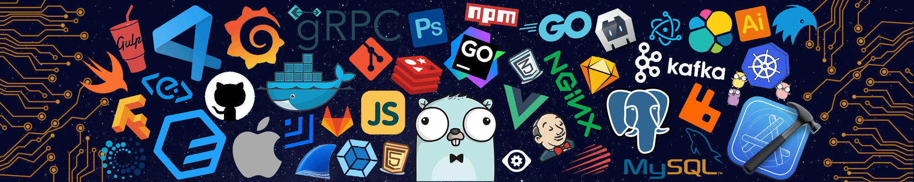

  

  
  
  
  
  
  

  

## 📊 Skills & Expertise

| Property | Data |
|----------|------|
| **Language / IDE** |        |
| **Domain Knowledge** |     |
| **CI / CD** |        |
| **Databases** |    |
| **Machine Learning / Deep Learning frameworks** |       |

## 📈 GitHub Stats

## 📊 GitHub Activity Graph:

